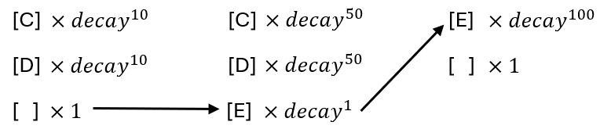
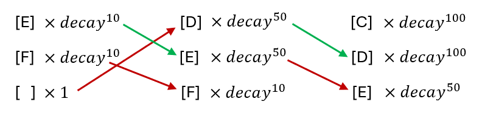

# GRAM's Music Synthesizer
## Key press detection
  ### Decoupled key scanning
  The `scanKeysTask` implemented in the lab instruction would always detect the pressed keys starting from the lowest position to the highest (0-12). This is okay if the sound waveform from each key is not changing over time. But with the
  decay function, the maximum amplitude of sound wave of each key is decreasing over time and the decay is independent to each key.
  
  This would create the issue of keys being desynchronised (see section 2). To solve this issue, when a key is released, it must remain at the same position as before instead of moving to a lower position. In other words, the keys must be detected in the order of their presses, not in the order of their position.
  
  First, a Boolean array of length 12 is used in place of the input variable. For every key scanning execution, the key that’s being pressed is registered true in corresponding entry in the array and this key will get skipped in the next scanning iteration. There are 3 cases that can happen:
  1.	A key was previously not being pressed and is now being pressed. In this case, the entry in the array corresponding to that key is set true and `nok` will increase by 1.
  
  3.	A key was previously being presses and is now released. In this case we used a std::find function to location the index in the array corresponding to the released key. The entry at that index will get set false. And nok will decrease by 1.
  4.	A key was not pressed before and remains undressed or was pressed and remains being presses. Do nothing in this case.

## Display
  ### Description
  It is a thread with priority 1 as it has the longest initiation interval of 100ms. This function is responsible for calling repeatedly displayUpdateFunction for displaying on the OLED display screen: which note is selected, if a key is pressed or released and the knobs rotation (volume, decay, in which octave it is, instrument selection). 
  ### Code analysis
  The task is implemented as a FreeRTOS task using xTaskCreate. It has a period of 100ms as specified by xFrequency. It retrieves the task handle to manage task operations. The displayUpdateFunction is called within this task to update the OLED display content. The OLED display update involves clearing the buffer, drawing text and graphics, and sending the buffer to the display.
## User interface
The main control interface of the system is via the 4 knobs on the keyboard. Each knob is responsible for change the: volume, decay rate, instrument and octave of the sound played.
## Instrument waveform generation
  ### Instrument look-up-table (LUT)
  Commercial synthesizers stores sound waveforms in their internal memory. This is because a lot of the real instrument sounds cannot be easily generated using mathematical functions. A typical approach is to record the sound of instruments playing, and then extract a section of it then play it repeatedly.

To do this, a `std::vector<std::vector<std::vector<uint16_t>>> waveform_lut` is created. It’s a IxfxT C++ vector where I is the number of instruments, f is the number of frequencies (in this case 12) and T is the number of entries in a full period of that frequency. 

Inside the double buffer writing task, Vout is calculated by reading the entries in waveform_lut by indexing with instru, tone_idx, t and Ts. The summed amplitude from multiple frequencies will be divided by the number of keys (nok) to ensure it’s between 0 and 4095. The first dimension of the lut contains all the stored instrument samples playable. The second dimension contains all the sound samples of all the freqeuncies of that instrument. And the last dimension contains the amplitude samples of a single period waveform of a particular frequency. Since the vector size is finite and it is required to loop through every samples of a period, we cannot let the timer t to increase indefinitely. Instead, we used the remainder `t % Ts[tone_idx[i]]` to access an entire preiod repeatedly. `uint16_t Ts[37]` stores the 36 periods plus a idle period and the `tone_idx` is used to access which periods are present.

## Audio
  ### Tone decay
  Some Instruments has the property of producing sound whose amplitude decreases overtime. To replicate this effect in a digital synthesiser, Vout need to decrease over time. A new variable `double decay_factor` is created. During each interrupt of `SampleISR()` function, if any key press is detected (see 'Decoupled key scanning'), the decay factor variable will multply by itself to create an expoential decay of `Vout` output volume: $Vout = (decay factor) ^ t$. The decay factor is distinguishable for every pressed key and as soon as a key is released, `decay_factor` is reset to 1;
  ### Issues with using decay with lut
  Because the keys are being detected in the order of their position, we will encounter 2 possible error scenarios where:
  1. If there are existing keys that have been presses for a while. Their decay factor would have been quite small.
  2. Then if a new key enters the tone_idx array, it will be positioned at the end of the array. The decay factor of thie new tone however, is still quite large while the decay factor of the previous 2 keys are getting even smaller.
  3. Then if the first 2 keys are being released, the array would reallocate the 3rd key to the start of this array.
  4. This resulted in a sudden change of volume of key 'E'.
  
  1. If there are some higher pitched keys being pressed previously, their decay factor would be small.
  2. Then if a lower pitched key is pressed, it will get allocated to the start of the array.
  3. The new key will immediately have a quite volume, even though it is not supposed to happen.
  \\
  To solve this issue, we need to make sure that the keys always remain at in the same location in the `tone_idx` array throughout.
  
  ### Beat function
  The synthesizer also has the function of using the keyboard as a beat generator.
The difference between the waveform sound and a beat sound is that, an waveform is periodic whereas a beat is typically non-periodic and has a varying frequency over time. To solve this issue, a switch is used in the Vout calculation.
First, the first few instruments (0-2) were assigned to be waveform generating and the remaining (3-4) to be the beats. If instru variable is greater than 2, we enter the beat generating section.
In the beat generating section, the entries stored in waveform_lut must only repeat for 1 period then stop. To do this, the timer variable t is clipped at the maximum period length of a particular key tone.
  Because of the non-periodicity of a beat sound wave, it is not efficient to use it in combination with the RX/TX function as it would results in additional variables being created to detect whether a receieved instruction demands a beat to be generated since this would addes workload in the `SampleISR()` function. A more practical way is to configure a single keyboard section as beat generating and the other 3 as instruments during compile time.

## Communication
## Threads timing analysis
The table below summarised all the tasks with their priority and timing constrains:
| Task name | initiation int. | latent execution time | priority|
| --- | --- | --- | --- |
| display | 100ms | 16.519ms | 4 |
| Key scanning | 20ms | 0.299ms | 1 |
| ISR sampling | 0.045ms | 0.003ms | interrupt |
| Data transmission | 60ms | 0.36ms | 3 |
| Data decoding | 25.2ms | 0.468ms | 2 |

The system's critical instant, $t_c$ must be less than the longest initiation interval, $\tau_n$ amoung the tasks. In this case, $\tau_n = 100ms$. The critical instant is calculated using:
$$t_c = \sum_{k=1}^n \frac{\tau_n}{\tau_k}T_k$$
Where $T_k$ is the latent execution time of each task. Based on the formula, the critical instant of our system is found to be 10.619ms, which is well below 100ms. The total execution time of each threads for exactly once was found to be 844.524ms. Therefore the percentage CPU utilisation is $\frac{16.519 + 0.299 + 0.003 + 0.36 + 0.468}{844.524} \times 100 = 2$ %.
## Methods used to guarantee safe access and synchronization:
  ### Semaphore-Based Mutex for Critical Sections:
  In Inputs.cpp, Knob.cpp, and RX_message.cpp, a semaphore-based mutex is employed to protect critical sections of code where shared data is accessed or modified. For instance, in Inputs.cpp, Knob.cpp, and RX_message.cpp, the xSemaphoreTake() and xSemaphoreGive() functions are used to acquire and release the semaphore, respectively, ensuring exclusive access to shared data structures (currentInputs, previousInputs, rotation, rotationISR, currentStepSize, RX_Message) during updates or reads.
  Mutex Initialization:
Each class (Inputs, Knob, RX_Message) initializes its mutex in its constructor (SysState.cpp) using xSemaphoreCreateMutex().
  Semaphore Timeouts:
Semaphores are acquired with a timeout (portMAX_DELAY) to prevent deadlock situations where a task may indefinitely block waiting for a resource that never becomes available.
  ### Atomic Load and Store Operations:
  In Knob.cpp, atomic load and store operations (__atomic_load_n()) are used to safely access the rotationISR variable without the need for explicit mutex locking.
  Separation of Concerns:
  Each class (Inputs, Knob, RX_Message) encapsulates its data and methods, promoting modular and structured code design.

