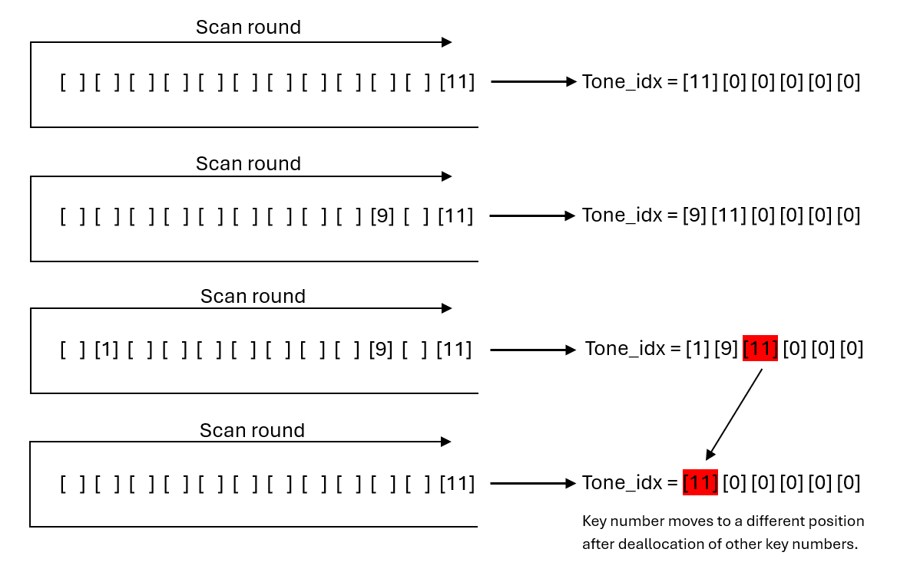
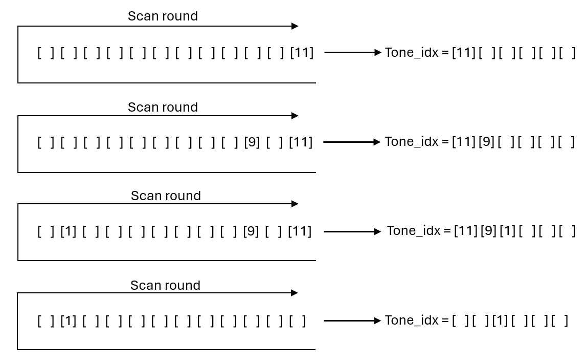
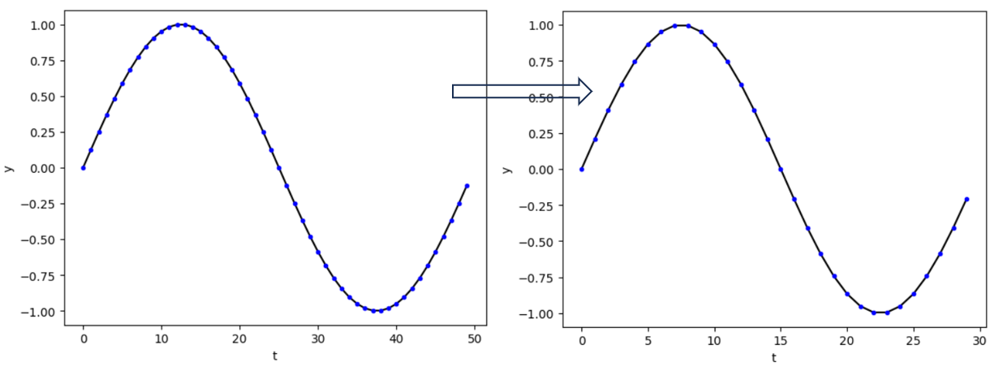
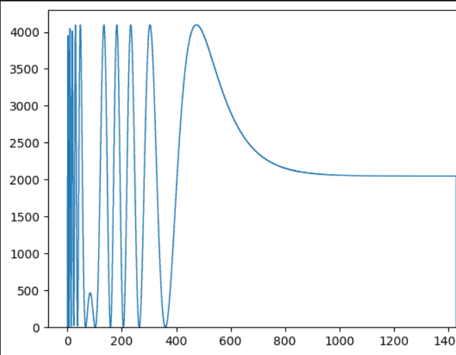

# GRAM's Music Synthesizer

# Table of Contents
1. [Key Press Detection](##Key_press_detection)
2. [Display](##Display)
3. [Third Example](#third-example)
4. [Fourth Example](#fourth-examplehttpwwwfourthexamplecom)

## Key press detection
  ### Basic key scanning
  First, we define a function that is used to address the decoder multiplexer of the key matrix.
  ```c++
  void setRow(uint8_t rowidx) {
  ...
}
  ```
  The input to the function is an integer which selects each bit of input to the multiplexer. This integer is then converted to a bit stream to seperate each bits:
  ```
  ...
  std::bitset<3> Ridx = std::bitset<3>(rowidx);
  HAL_GPIO_WritePin(GPIOB, GPIO_PIN_0, gpio_state[Ridx[0]]); // RA0_PIN
  HAL_GPIO_WritePin(GPIOB, GPIO_PIN_1, gpio_state[Ridx[1]]); // RA1_PIN
  HAL_GPIO_WritePin(GPIOB, GPIO_PIN_4, gpio_state[Ridx[2]]); // RA2_PIN
  ...
  ```
  The `digitalRead()` functions are replaced by `!HAL_GPIO_ReadPin()` to increase execution speed. The `gpio_state[2]` array stores the `enum GPIO_Pinstate` data type that is used to output HIGH or LOW signals to the GPIO pins.\
  Then in `scanKeysTask`, `digitalRead(GPIOA, col)` is replaced by `HAL_GPIO_ReadPin(GPIOA, col)` instead. The input to `col` is a array of length 4 defined as `uint32_t key_cols[4] = {GPIO_PIN_3, GPIO_PIN_8, GPIO_PIN_7, GPIO_PIN_9};`.
  Then, a for loop of 12 iterations is used to loop through the 12 keys.
  ```c++
  for (int i = 0; i < 12; i++) {
    ...
  }
  ```
  Then, use floor division `/` to ensure that only 3 rows are being addressed for 12 iterations: `setRow(i / 4)`. The remainder operation `%` is used to loop through each column in each row: `!HAL_GPIO_ReadPin(GPIOA, key_cols[i % 4])`. This enables the read key function to be executed in a single loop. For each key being detected:
  ```c++
  keynum = i + 1 + octave * 12;
  tone_idx[nok] = keynum;
  key = key + keystrings[i + octave * 12];
  nok ++;
  TX_Message[0] = 'P';
  ```
  The array `tone_idx` contains the key number `keynum` of the pressed key. `keynum` is increased by 12 times `octave` if the octave of the keyboard changes during operation. The string `key` reads and appends the new key from string array `keystrings`, which contains the symbols of all possible keys from C1 to B3. The `nok` variables stored the total keys being pressed simutaneously and the transmission message `TX_message` will be set to 'P'.
  ### Decoupled key scanning
  The `scanKeysTask` implemented in the lab instruction would always detect the pressed keys starting from the lowest position to the highest (0-12). This is okay if the sound waveform from each key is not changing over time. But with the `damp` function, the maximum amplitude of sound wave of each key is decreasing over time and the damping is independent to each key.
  
  This would create the issue of keys being desynchronised (see section 2). To solve this issue, when a key is released, its index stored in `tone_idx` must remain at the same position as before instead of moving to a lower position. In other words, the keys must be detected in the order of their presses, not in the order of their position.
  
  First, a Boolean array of length 12 `bool press_list[12]` is used in place of the input variable. For every key scanning execution, the key that’s being pressed is registered true in the corresponding entry in the array and this key will get skipped in the next scanning iteration. There are 3 cases that can happen:
  1.	A key was previously not being pressed and is now being pressed. In this case, the entry in the array corresponding to that key is set true and `nok` will increase by 1.
  ```c++
  for (int i = 0; i < 12; i++) {
    if (!HAL_GPIO_ReadPin(GPIOA, key_cols[i % 4]) && !press_list[i]) {
      press_list[i] = true;
      ...
    }
    ...
  }
  ```
  2.	A key was previously being pressed and is now released. In this case we used `std::find()` function to locate the index in the array corresponding to the released key. The entry at that index will get set false. And nok will decrease by 1. `std::distance` calculates the index position of the keynumber inside the `tone_idx` array.
  ```c++
  for (int i = 0; i < 12; i++) {
    ...
    if (HAL_GPIO_ReadPin(GPIOA, key_cols[i % 4]) && press_list[i]) {
      press_list[i] = false;
      int* p = std::find(std::begin(tone_idx), std::end(tone_idx), i + 1 + octave * 12);
      int idx = std::distance(tone_idx, p);
      tone_idx[idx] = 0;
      TX_Message[0] = 'R';
      ...
    }
    ...
  }
  ```
  3.	A key was not pressed before and remains unpressed or was pressed and remains being pressed. Do nothing in this case.

  The two figure below shows a comparison of key number storing operations under traditional method and decoupled key scanning.
  
  

## Display
  ### Description
  It is a thread with priority 1 as it has the longest initiation interval of 100ms. This function is responsible for calling repeatedly displayUpdateFunction for displaying on the OLED display screen: which note is selected, if a key is pressed or released and the knobs rotation (volume, decay, in which octave it is, instrument selection). 
  ### Code analysis
  The task is implemented as a FreeRTOS task using xTaskCreate. It has a period of 100ms as specified by xFrequency. It retrieves the task handle to manage task operations. The displayUpdateFunction is called within this task to update the OLED display content. The OLED display update involves clearing the buffer, drawing text and graphics, and sending the buffer to the display.
## User interface
The main control interface of the system is via the 4 knobs on the keyboard. The knobs (from right to left) change:
- Volume (12 levels possible)
- Decay (3 modes)
- Instrument (3 instruments)
- Octave ()

The `Knob.h` and `Knob.cpp` contains the operations which reads the binary code bits of the knob row of the key matrix. These classes inherit their mutexes from `sysState.h` which in it's destructor also ensures that the mutex is freed. `Knob::Knob()` (constructor) set the upper, lower bound of a knob variable and the increment size whenever the knob is rotated. This is convenient because the knobs have different purposes and different boundaries of operation. `Knob.updateRotation()` detects the changes in the binary bit pairs:
| BA prev | BA next | operation |
| --- | --- | --- |
| 00 | 01 | + increment |
| 11 | 10 | + increment |
| 01 | 00 | - increment |
| 10 | 11 | - increment |

To improve detection resolution, the indeterminant states of the knob rotation is taken into account. This is done using the private variable `incrementLast` which keeps track of if the last operation was an increment or not. The logic flow has been illustrated in the table below:
| BA prev | BA next | last operation is + increment? | operation |
| --- | --- | --- | --- |
| 11 | 00 | Yes | + increment |
| 11 | 00 | No | - increment |
| 10 | 01 | Yes | + increment|
| 10 | 01 | No | - increment |
| 01 | 10 | Yes | + increment |
| 01 | 10 | No | - increment |
| 00 | 11 | Yes | + increment |
| 00 | 11 | No | - increment |

`Knob::getRotationISR()` performs atomic load and store operation and `Knob::getRotation()` returns the curent rotation value of a `Knob` class variable. It is thread safe and acquires the previously mentioned mutex (from the constructor of the parent `sysState` class).
## Instrument waveform generation
  ### Instrument look-up-table (LUT)
  Commercial synthesizers stores sound waveforms in their internal memory. This is because a lot of the real instrument sounds cannot be easily generated using mathematical functions. A typical approach is to record the sound of instruments playing, and then extract a section of it then play it repeatedly.

  To do this, a `std::vector<std::vector<std::vector<uint8_t>>> waveform_lut` is created. It’s an `IxfxT` C++ vector where `I` is the number of instruments, `f` is the number of frequencies (in this case 12) and `T` is the number of entries in a full period of that frequency. 
  
  Inside the double buffer writing task, Vout is calculated by reading the entries in waveform_lut by indexing with instru, tone_idx, t and Ts. The summed amplitude from multiple frequencies will be divided by the number of keys (nok) to ensure it’s between 0 and 4095. The first dimension of the lut contains all the stored instrument samples playable. The second dimension contains all the sound samples of all the frequencies of that instrument. And the last dimension contains the amplitude samples of a single period waveform of a particular frequency. Since the vector size is finite and it is required to loop through every samples of a period, we cannot let the timer t to increase indefinitely. Instead, we used the remainder `t % Ts[tone_idx[i]]` to access an entire period repeatedly. `uint16_t Ts[37]` stores the 36 periods plus a idle period and the `tone_idx` is used to access which periods are present.
  
  ### Memory optimisation
  One issue with using a lut is that it taken up a significant amount of static memory in the CPU. This may not be a problem for commercial synthesizers as they tend to have more storage available. However, for our lab ketboard, it is crucial to optimise the memory usage.
  
  The traditional method of incoporating a waveform LUT into `SampleISR` involves storing the amplitudes of a single period for all possible frequencies for all instruments. This quickly get inefficient as there can be as many as 96 frequencies hence $instruments \times 96 \times T$ entries in total. Let's say a commercially viable synthesizer needs 50 different instruments and the average period length contains around 466 entries, then there will be $50 \times 96 \times 466 = 2236800$ entries or 8.95 MB if using 32 bits entries (A STM32 processor typically has 2 MB of flash memory)!
  
  To optimise the LUT storage, we use the undersampling technique. This method involves delibrately causing favourble aliasing effect by not sampling all the entries of a period. First, it is needed to define a base waveform which has the lowest frequency (such as C0) and the most entries in a single period. Then, to obtain all other frequencies higher than the base frequency, we'll only need to sample the base waveform at intervals greater than 1. For a base waveform with period $T_0 = N$ entries and we want to sample it at $T_1 = n$ entries, the formula below gives the desirable sampling interval:
  $$t_s = (t * \frac{N}{n}) \space mod \space N, \space n \le N$$
  Where t is the base timer that increment by 1 for every sample iteration. This increases the memeory efficient by a factor of 96 as only 1 out of 96 freqeuncies is needed to output all other frequencies. The 3-dimensional LUT is now 2-dimensional:
  
`std::vector<std::vector<uint8_t>> waveform_lut;`
  
  

## Audio
  ### Instrument LUT in SampleISR()
  The cumulative `stepSize` in SampleISR function is replaced with a LUT read operation where `instru`, `tone_idx` and `Ts` are used to read a single amplitude of a single frequency from the LUT. This operation is repeated for as many number of keys (determined by the `nok` varaible). The resultant `Vout` is the sum of all amplitude at time `t`.
  
  ### Damping strength
  Some Instruments has the property of producing sound whose amplitude decreases overtime, e.g. the pedals of a piano. To replicate this effect in a digital synthesiser, Vout need to decrease over time. A new variable `double damp_factor` is created. During each interrupt of `SampleISR()` function, if any key press is detected (see 'Decoupled key scanning'), the decay factor variable will multply by itself to create an exponential decay of `Vout` output volume: `Vout = damp_factor * damp_factor`. The damp factor is distinguishable for every pressed key and as soon as a key is released, `damp_factor` is reset to 1 (idle state);
  ### Decay factor variable in SampleISR()
  Ideally, we would want a standard exponential function: decay_factor/$d = e^{t}$. But `std::pow()` is a slow execution in C++ and if put into the SampleISR, would result in meeting of execution deadline and cause distorted or no audio output. Hence the expoential operation is replaced with an index function.
  Another issue with decay_factor is that it is a `float` variable. Since decay_factor is changed by `class Knob`, which involves atomic operations (atomic operations does not allow floating points), we need to define a temp integer variable of damp_factor inside the `scanKeysFunctions`. This temp variable is changed by `dampKnob` and is divided by 100000 to convert to a float.\
  A better option would be to use an array which stores all the damping factors and then use the integer returned by `dampKnob` to index the array to select the desirable damping factor.
  
  ### Issues with using decay with lut
  Because the keys are being detected in the order of their position, we will encounter 2 possible error scenarios where:
  1. If there are existing keys that have been pressed for a while. Their decay factor would have been quite small.
  2. Then if a new key enters the tone_idx array, it will be positioned at the end of the array. The decay factor of thie new tone however, is still quite large while the decay factor of the previous 2 keys is getting even smaller.
  3. Then if the first 2 keys are being released, the array would reallocate the 3rd key to the start of this array.
  4. This resulted in a sudden change of volume of key 'E'.
  
  1. If there are some higher pitched keys being pressed previously, their decay factor would be small.
  2. Then if a lower pitched key is pressed, it will get allocated to the start of the array.
  3. The new key will immediately have a quite volume, even though it is not supposed to happen.
  \\
  To solve this issue, we need to make sure that the keys always remain at the same location in the `tone_idx` array throughout.
  
  ### Beat function
  The synthesizer also has the function of using the keyboard as a beat generator.
The difference between the waveform sound and a beat sound is that a waveform is periodic whereas a beat is typically non-periodic and has a varying frequency over time. To solve this issue, a switch is used in the Vout calculation.

  
  
First, for `instru` option of 0-2, we assign them to be waveform generating and the remaining `instru = 3 or 4` to be the beats. If `instru` is greater than 2, we enter the beat generating section.
```
if (instru <= 2) {
    idx[0] = t % Ts[tone_idx[0]];
    idx[1] = t % Ts[tone_idx[1]];
    idx[2] = t % Ts[tone_idx[2]];
    ...
}
else {
    idx[0] = std::min(t, Ts[tone_idx[0]] * 5 - 1);
    idx[1] = std::min(t, Ts[tone_idx[1]] * 5 - 1);
    idx[2] = std::min(t, Ts[tone_idx[2]] * 5 - 1);
    ...
}
Vout = (waveform_luts[instru][tone_idx[0]][idx[0]] * decay[0] +
        waveform_luts[instru][tone_idx[1]][idx[1]] * decay[1] +
        waveform_luts[instru][tone_idx[2]][idx[2]] * decay[2] +
        ...    
```
The temporary variable `idx` will change depending on whether the function is instruemnt or beat. In the beat generating section, the entries stored in waveform_lut must only repeat for 1 period then stop. To do this, the timer variable t is clipped at the maximum period length of a particular key tone.
  Because of the non-periodicity of a beat sound wave, it is not efficient to use it in combination with the RX/TX function as it would result in additional variables being created to detect whether a received instruction demands a beat to be generated since this would add workload in the `SampleISR()` function. A more practical way is to configure a single keyboard section as beat generating and the other 3 as instruments during compile time.

  ### Double buffer
  
  One issue that can occur when generating an audio sample is that it can become computationally expensive. This can occur when summing multiple waveforms in our waveform LUTs. If the ISR becomes too heavy for the CPU to bear it can lead to a variety of issues, such as, requiring to setup interrupts carefully or having conflicts with the freeRTOS system. One way to solve this problem is to reduce the size of the ISR and make it as efficient as possible. We can modify our sampleISR() function and make it so it only transfers samples to the DAC, dealing with sample generation in an alternative thread. To implement this synchronisation mechanism we make use of a Double Buffer, it works by splitting an array into two halves, the two halves are then read and written to atomically and when the pointers reach both ends they are swapped.
    
  ```c++
  struct {
  uint32_t sampleBuffer0[SAMPLE_BUFFER_SIZE / 2];
  uint32_t sampleBuffer1[SAMPLE_BUFFER_SIZE / 2];
  volatile bool writeBuffer1 = false;
  SemaphoreHandle_t doubleBufferSemaphore;
  } doubleBuffer; 
  ```
  In our implementation we created a struct which contained all the relevant data types. The semaphore is given on startup so the thread doesn't block on the first loop and its given when the buffer pointers swap and the semaphore is then taken again inside our sample generation task, the doubleBufferTask(). 
  ```c++
  doubleBuffer.doubleBufferSemaphore = xSemaphoreCreateBinary();
  xSemaphoreGive(doubleBuffer.doubleBufferSemaphore);
  ```
  ```c++
  void sampleISR() {
  static uint32_t readCtr = 0;
  if (readCtr == SAMPLE_BUFFER_SIZE / 2) {
    readCtr = 0;
    doubleBuffer.writeBuffer1 = !doubleBuffer.writeBuffer1;
    xSemaphoreGiveFromISR(doubleBuffer.doubleBufferSemaphore, NULL);
  }
  ...
  ```
  ```c++
  void doubleBufferTask(void *pvParameters) {
  while (1) {
    xSemaphoreTake(doubleBuffer.doubleBufferSemaphore, portMAX_DELAY);
    ...
  ```

  ## DAC with DMA:
  
  Although we have not been able to integrate this feature we thought to still include it in our report. To improve upon the Double Buffer feature we can make use of Direct Memory Addressing, this is a feature present in the ARM cortex M4 which implements a hardware controller which can offload data transferring tasks off of the CPU. This would have been highly beneficial for our implementation as the DMA has timing and auto increment features and it would mean that we wouldn’t need to use an ISR at all and the DMA could handle transferring data from the double buffer to the DAC. The STM32 HAL APIs include an implementation of the DAC which can work with the DMA. This is what we attempted:

  ```c++
  uint32_t DAC_Init(DAC_HandleTypeDef hdac, DMA_HandleTypeDef hdma_dac){
    // Initialize DAC + DMA Channel
   
     __HAL_RCC_DMA1_CLK_ENABLE();
  
    hdma_dac.Instance = DMA1_Channel3;
    hdma_dac.Init.Request = DMA_REQUEST_6;
    hdma_dac.Init.Direction = DMA_MEMORY_TO_PERIPH;
    hdma_dac.Init.PeriphInc = DMA_PINC_DISABLE;
    hdma_dac.Init.MemInc = DMA_MINC_ENABLE;
    hdma_dac.Init.PeriphDataAlignment = DMA_PDATAALIGN_WORD;
    hdma_dac.Init.MemDataAlignment = DMA_MDATAALIGN_WORD;
    hdma_dac.Init.Mode = DMA_CIRCULAR;
    hdma_dac.Init.Priority = DMA_PRIORITY_HIGH;
  
     HAL_DMA_Init(&hdma_dac);
  
    __HAL_RCC_DAC1_CLK_ENABLE();
  
    hdac.Instance = DAC1;
  
    return (uint32_t) HAL_DAC_Init(&hdac);
   
  }
  
  ``` 
  This function would have been use to initialise both the DAC and DMA for our stm32l432kc board, it works by configuring both dac and dma handle types and running the HAL_XXX_Init() functions. Once the initialisationn was complete a link is created between the DAC and DMA and the HA_DAC_Start_DMA() function would have been executed which initiated the data transfer via DMA.

  ```c++
  uint32_t DAC_Start(DAC_HandleTypeDef hdac, DMA_HandleTypeDef hdma_dac, uint32_t buffer_size, uint32_t* dacBuffer ){
  	// Start the DAC with DMA
   	__HAL_LINKDMA(&hdac, DMA_Handle1, hdma_dac);
  
  	return (uint32_t) HAL_DAC_Start_DMA(&hdac, DAC_CHANNEL_1, dacBuffer, buffer_size, DAC_ALIGN_12B_R);
  }
  ```


## Communication
Communication was implemented in two phases: receiving and transmitting. To denote which mode the keyboard is in, the following build flags were used:
- `RECEIVER`: The keyboard is in receive mode. It will receive the tone of the note to be played with the octave already a part of it. There is no cross keyboard polyphony, so the keyboard would only play one note at a time. A 'P' message would initiate the playing of the note and an 'R' message would stop the note from being played. The `tone_idx` and the `nok` (signifying the number of keys) would be overwritten only if the keyboard is not in `LOOPBACK` mode (it would then be considered a transmitter and receiver). These values are then used by the `doubleBufferTask` to play the given note.
- `TRANSMITTER`: The keyboard is in transmit mode. It will transmit a message from the `scanKeysTask` which would determine which note needs to be played. Similar to key scanning, the tone index would be calculated with the help of the octave and the note played, and sent to as a message along with a 'P' if the note was pressed or 'R' if it was released.
- `LOOPBACK`: The keyboard is in loopback mode. It will receive messages sent to itself. Since there is no real purpose of processing  a message received from itself, processing is disabled with a guard clause:
    ```c++
    if (!transmitter || xSemaphoreTake(protectedGlobals.mutex, portMAX_DELAY) == pdTRUE) {
    ```
    The guard clause also checks if the semaphore     protecting all of the global variables shared across     threads is available to be acquired.

The `transmitter` and `receiver` booleans are global variables but do not need to be declared as `volatile` or be protected by a semaphore. Since these are convenience variables part of the configuration options of the keyboard, their value will never change and in face the compiler will ensure that it is cached to increase execution speed if compiled with the `-O3` (all optimizations on) flag.
### Receiving messages
Initially, to implement receiving messages from one keyboard to the other, the `CAN_RX()` method was used, which would poll for messages which was inefficient because messages could be missed in the display thread. To counter this:
- A message queue of size 36 was implemented, storing 8 byte arrays (unsigned integers). The queue is a FIFO (first in first out) data structure. A more comprehensive analysis of the queue's functionality can be found in the inter task dependencies section below.
- An interrupt `CAN_RX_ISR` would then move the incoming message into the queue (one at a time). This is effective because there is no longer a strong possibility of missing multiple messages. This also improves the separation of concerns between tasks, and improves the speed of message processing because messages no longer have to wait in transit, and the moment a message is received the RTOS interrupts to put it onto the queue. The ISR was initialized with the `CAN_Register_ISR` similar to the ISR for the transmission task.
- The bulk of the message processing was done by the `CAN_RX_Task`. As mentioned in the previous sections, playing a note on the receiver was dependent on the `doubleBufferTask` (`nok` and `tone_idx`). If the keyboard was in loopback mode, this task is redundant and does nothing (but is still needed to receive and transmit messages to itself).\
Messages were not displayed on the display and there was no merit in declaring the variables associated with receiving messages as globals.
### Transmitting messages
Similar to receiving messages, transmitting messages depended on the polling function `CAN_TX` which without optimization, could miss messages. A similar solution to the receive queue was devised where messages were fed to it the moment they were available. The `scanKeysTask` held the responsibility of putting messages onto the queue when a key is pressed or released as stated previously. Since the CAN bus on the STM32 has three mailbox slots for outgoing messages, using a counting semaphore to guard this resource was the best option. This was achieved using:
- A message queue with the same structure as the receive queue.
- A thread, `CAN_TX_Task`, which would take a message sent by `scanKeysTask` whenever a 'P' or 'R' event occured and put these onto the transmit queue.
- An interrupt `CAN_TX_ISR`. This interrupt would give the semaphore when a mailbox is available. After all 3 slots were filled, it would block until after at least one was empty (hence a ternary counting semaphore). Due to this, a transmitting keyboard would not be able to play sounds on its own (without being connected to a receiving keyboard).

|Mode| Active Tasks|
|---|---|
|`RECEIVER`|`CAN_RX_Task`, `doubleBufferTask`, `CAN_RX_ISR`, overwriting `nok` & `tone_idx`|
|`TRANSMITTER`||
|`LOOPBACK`||
## Timing analysis
To imeplement timing analysis of each task, we must let each task to run only once. To do this, we defined a `XXXFunction()` which is called repeatedly in a `XXXTask()`:
```
void XXXTask(void * parameters) {
  while(1) {
    XXXFunction();
  }
```
This enables both indefinite and single execution of any task.
The table below summarised all the tasks with their priority and timing constrains when operating under worst-case-scenario with STM32 scheduler tick delay being taken into account:
| Task name | initiation int. | latent execution time | priority|
| --- | --- | --- | --- |
| display | 100ms | 17.64ms | 1 |
| Key scanning | 20ms | 1.287ms | 4 |
| DoubleBuffer | 17ms | 3.035ms | 5 |
| DoubleBuffer ISR | 0.045ms | 0.009ms | interrupt |
| Data transmission | 60ms | 1.504ms | 2 |
| Data decoding | 25.2ms | 1.324ms | 3 |

The system's critical instant, $t_c$ must be less than the longest initiation interval, $\tau_n$ amoung the tasks. In this case, $\tau_n = 100ms$. The critical instant is calculated using:
$$t_c = \sum_{k=1}^n \frac{\tau_n}{\tau_k}T_k$$
Where $T_k$ is the latent execution time of each task. Based on the formula, the critical instant of our system is found to be 52.05ms, which is well below 100ms. The percentage CPU utilisation is given by:

$$U_T = \sum_{k=1}^n \frac{T_k}{\tau_k}$$

Hence the percentage utilisation was found to be:

$(\frac{17.64}{100} + \frac{1.287}{20} + \frac{3.035}{17} + \frac{0.009}{0.045} + \frac{1.504}{60} + \frac{1.324}{25.2}) \times 100 = 68$ %.
## Methods used to guarantee safe access and synchronization:
  ### Semaphore-Based Mutex for critical Sections:
  In `Knob.cpp`, a semaphore-based mutex is employed to protect critical sections of code (RAII) where shared data is accessed or modified. The `xSemaphoreTake()` and `xSemaphoreGive()` functions are used to acquire and release the semaphore, respectively, ensuring exclusive access to shared data structures (`rotation`, `rotationISR`) during updates or reads.\
  The table below shows the variables that are accessed by multiple threads:
  | Variable name | Accessed by |
  | --- | --- |
  | `tone_idx[6]` | `scanKeysTask`, `doubleBufferTask`, `CAN_RX_TASK` |
  | `nok` | `scanKeysTask`, `doubleBufferTask`, `CAN_RX_TASK` |
 ### Mutex Initialization:
`Knob` initializes its mutex in its constructor (derived from parent `sysState.h`) using `xSemaphoreCreateMutex()``.
 ### Semaphore Timeouts:
Semaphores are acquired with a timeout `portMAX_DELAY` to prevent deadlock situations where a task may indefinitely block waiting for a resource that never becomes available.
  ### Atomic Load and Store Operations:
  In Knob.cpp, atomic load and store operations `__atomic_load_n()` are used to safely access the `rotationISR` variable without the need for explicit mutex locking.
 ### Separation of Concerns:
  `Knob` encapsulates its data and methods, promoting modular and structured code design.
## Inter-Task Dependencies

Above is a graphical illustration of our musical synthesiser program, each Task and ISR is represented by round rectangles and each dependecy is represented by an arrow. We can see starting from `scanKeysTask()` the `keys.mutex` dependecy is shared by both the `displayUpdate()` task and the `doubleBufferTask()`, this is acceptable as the mutex is thread-safe and would be unlocked before a task is finished. the `doubleBufferTask()` thread and the `doubleBufferISR()` both make use of the `doubleBuffer.sempahore` when writing and reading from the double buffer however this operation is deadlock free as `doubleBufferTask()` captures the semaphore during the sample generation and the ISR releases agin when it has finished swapping the pointers, the semaphore is also released once during the setup phase as to not block the first loop. When the board is setup in transmitter mode, a message queue is generated, whereby the 'scanKeysTask()` will send the 'msgOutQ` and the `CAN_TX_Task()` will receive it; The synchronisation of the `CAN_TX_Task()` is dictated by the `CAN_TX_Semaphore` which acts as a counting semaphore and essentially controls access to the CAN transmission process, this will not cause deadlock as the `CAN_TX_Semaphore` is taken when the thread wants exclusive access before sending a message and released onec the ISR has queued a message for transmission. If reciever mode is enabled, The `CAN_RX_ISR` is responsible to receive the CAN transmission and send the message queue via `msgInQ`, this is then in turn received by the the `CAN_RX_Task()`, decoupling the CAN reception allows them to operate independetly and ensure efficient message handling even under heavier loads, deadlock is prevented as the ISR is off-loaded, resulting in timely execution without the risk of delaying or blocking critical operations.